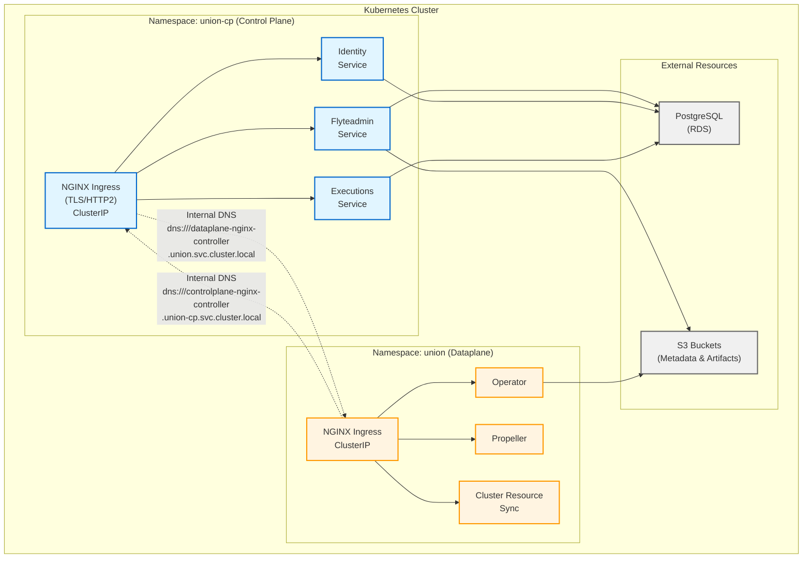

# Self-Hosted Intra-Cluster Deployment Guide (AWS)

This guide covers deploying Union control plane in the **same Kubernetes cluster** as your Union dataplane (co-located deployment). This is ideal for fully self-hosted Union deployments where both control plane and dataplane run in your infrastructure.

## Overview

In an intra-cluster deployment, the control plane and dataplane communicate using Kubernetes internal networking rather than external endpoints. This architecture simplifies networking, reduces costs, and provides complete data sovereignty.

**Important**: This guide assumes you will also deploy the dataplane in the same cluster. See the [Dataplane Intra-Cluster Guide](../dataplane/SELFHOSTED_INTRA_CLUSTER_AWS.md) for dataplane-specific configuration.

## Benefits of Intra-Cluster Deployment

- **Simplified networking**: All communication stays within the cluster
- **No external dependencies**: No internet connectivity required for control plane ↔ dataplane communication
- **Cost-effective**: Reduced network egress costs
- **Self-signed certificates**: Can use self-signed certs for intra-cluster TLS
- **Single-tenant mode**: Simplified security model with explicit organization configuration
- **Full data sovereignty**: All data and control remains in your infrastructure

## When to Use This Deployment Model

Choose intra-cluster deployment when:

- You want full control over both control plane and dataplane
- You're running in a single Kubernetes cluster
- You don't need Union's managed control plane services
- You want to minimize network egress costs
- You have strict data locality requirements

Choose standard hosted deployment when:

- Using Union's managed control plane (Union Cloud)
- Control plane and dataplane are in separate clusters
- You need Union's managed services and support

## Prerequisites

### Infrastructure Requirements

1. **Kubernetes cluster** (>= 1.28.0) with sufficient resources for both control plane and dataplane
   - Recommended: At least 6 nodes with 8 CPU / 16GB RAM each
   - Storage: Ability to create Persisten Volumes for Prometheus and ScyllaDB (if embedded)

2. **PostgreSQL database**:
   - Version: PostgreSQL 12+
   - Can be AWS RDS or self-hosted in the cluster (it's not deployed by the Helm chart)
   - Required for all control plane services. 
   - Memory-optimized instances are recommended.

3. **ScyllaDB** (for queue service):
   - Can be deployed via the Helm chart (embedded) or externally managed
   - Required for high-performance message queueing

4. **S3 buckets**:
   - One for control plane metadata
   - One for artifacts storage (can be same bucket)

5. **IAM roles** configured with IRSA:
   - Control plane services (with S3 access)
   - Artifacts service (with S3 access)

6. **cert-manager**
   - Used by the database to generate TLS certificate
   - It can be added as Add-on to your cluster or installed by different methos, as covered in [cert-manager docs](https://cert-manager.io/docs/installation/)

Check out the [deployment page](https://www.union.ai/docs/v1/selfmanaged/deployment/cluster-recommendations/#iam) for an example IAM policy.

### Required Tools

- `kubectl` configured to access your cluster
- `helm` 3.18+
- `openssl` or `cert-manager` for TLS certificate generation

### Network Requirements

- Network connectivity between control plane and dataplane namespaces (verify network policies)
- No external ingress required (optional for external access)

## Installation Steps

### Step 1: Install Prerequisites

#### Install ScyllaDB CRDs (if using embedded ScyllaDB)

```bash
curl -O https://raw.githubusercontent.com/unionai/helm-charts/refs/heads/main/charts/controlplane/scripts/install-scylla-crds.sh && bash install-scylla-crds.sh
```

#### Add Helm Repositories

```bash
helm repo add unionai https://unionai.github.io/helm-charts/
helm repo add flyte https://helm.flyte.org
helm repo update
```

### Step 2: Generate TLS Certificates

Since intra-cluster communication uses gRPC over HTTP/2, TLS is required for NGINX ingress.

**Option A: Using OpenSSL (self-signed)**

```bash
# Create a self-signed certificate
openssl req -x509 -nodes -days 365 -newkey rsa:2048 \
  -keyout controlplane-tls.key \
  -out controlplane-tls.crt \
  -subj "/CN=controlplane-nginx-controller.union-cp.svc.cluster.local"

# Create Kubernetes secret
kubectl create namespace union-cp
kubectl create secret tls controlplane-tls-cert \
  --key controlplane-tls.key \
  --cert controlplane-tls.crt \
  -n union-cp
```

**Option B: Using cert-manager (recommended for production)**

See the example #3 in `values.aws.selfhosted-intracluster.yaml` under the `extraObjects` section.

### Step 3: Create Database Password Secret

```bash
# Create secret with database password
kubectl create secret generic union-controlplane-secrets \
  --from-literal=pass.txt='YOUR_DB_PASSWORD' \
  -n union-cp
```

### Step 4: Configure Values File

Download and configure the intra-cluster values file:

```bash
# Download the self-contained intra-cluster configuration file
curl -O https://raw.githubusercontent.com/unionai/helm-charts/main/charts/controlplane/values.aws.selfhosted-intracluster.yaml
```

Edit `values.aws.selfhosted-intracluster.yaml` by setting all `global` values and replace all empty `""` values. This file is self-contained and includes all necessary AWS and intra-cluster configuration.


### Step 5: Install Control Plane

Install the control plane using the self-contained intra-cluster values file:

```bash
helm upgrade --install unionai-controlplane unionai/controlplane \
  --namespace union-cp \
  --create-namespace \
  --values values.aws.selfhosted-intracluster.yaml \
  --timeout 15m \
  --wait
```

**Important notes:**

- `values.aws.selfhosted-intracluster.yaml` is self-contained and includes all necessary configuration
- No additional values files are required
- The file configures single-tenant mode and internal networking for intra-cluster communication

### Step 6: Verify Control Plane Installation

```bash
# Check pod status
kubectl get pods -n union-cp

# Verify services are running
kubectl get svc -n union-cp

# Check flyteadmin is accessible
kubectl logs -n union-cp deploy/flyteadmin --tail=50

# Test internal connectivity
kubectl exec -n union-cp deploy/flyteadmin -- \
  curl -k https://controlplane-nginx-controller.union-cp.svc.cluster.local
```

Expected: All pods should be in `Running` state, and internal connectivity should succeed.

### Step 7: Deploy Dataplane

After the control plane is running, deploy the dataplane following the [Dataplane Intra-Cluster Guide](../dataplane/SELFHOST_INTRA_CLUSTER_AWS.md).

The dataplane will connect to the control plane using the service endpoints configured in Step 3.

## Key Configuration Details

### Single-Tenant Mode

Intra-cluster deployments uses an experimental single-tenant mode with an explicit organization. Refer to [values.aws.selfhosted-intracluster.yaml](./values.aws.selfhosted-intracluster.yaml) for example configuration.

```yaml
global:
  # Update here to your organization designation
  UNION_ORG: ""

  # There are references to .Values.globa.UNION_ORG where the
  # override is configured.
```

### TLS Requirements

gRPC requires TLS for HTTP/2 with NGINX. Refer to [values.aws.selfhosted-intracluster.yaml](./values.aws.selfhosted-intracluster.yaml) for example configuration.

```yaml
global:
  # Configure namespace and name of the Kubernetes TLS secret.
  TLS_SECRET_NAMESPACE: ""
  TLS_SECRET_NAME: ""

ingress-nginx:
  controller:
    extraArgs:
      # NOTE: This has to be explicitly set.
      default-ssl-certificate: "<TLS_SECRET_NAMESPACE>/<TLS_SECRET_NAME>"
```

### Service Discovery

Control plane services discover each other via Kubernetes DNS:

- **Flyteadmin**: `flyteadmin.union-cp.svc.cluster.local:81`
- **NGINX Ingress**: `controlplane-nginx-controller.union-cp.svc.cluster.local`
- **Dataplane** (for dataproxy): `dataplane-nginx-controller.union.svc.cluster.local`

## Architecture Diagram



**Key Points:**

- **Blue (Control Plane)**: Services in `union-cp` namespace
- **Orange (Dataplane)**: Services in `union` namespace
- **Gray (External)**: AWS-managed resources (RDS, S3)
- **Dotted Lines**: Intra-cluster communication via Kubernetes DNS
- **Solid Lines**: Service dependencies within namespaces

## Troubleshooting

### Control plane pods not starting

```bash
# Check pod events
kubectl describe pod -n union-cp <pod-name>

# Check for resource constraints
kubectl top nodes

# Verify secrets exist
kubectl get secret -n union-cp
```

### TLS/Certificate errors

```bash
# Verify TLS secret exists
kubectl get secret controlplane-tls-cert -n union-cp

# Check certificate details
kubectl get secret controlplane-tls-cert -n union-cp -o jsonpath='{.data.tls\.crt}' | base64 -d | openssl x509 -text -noout

# Check NGINX ingress logs
kubectl logs -n union-cp deploy/controlplane-nginx-controller
```

### Database connection failures

- Verify database credentials in the secret:

  ```bash
  kubectl get secret union-controlplane-secrets -n union-cp -o jsonpath='{.data.pass\.txt}' | base64 -d
  ```

- Check network connectivity to PostgreSQL:

  ```bash
  kubectl run -n union-cp test-db --image=postgres:14 --rm -it -- \
    psql -h <DB_HOST> -U <DB_USER> -d <DB_NAME>
  ```

### Dataplane cannot connect to control plane

- Verify control plane service endpoints:

  ```bash
  kubectl get svc -n union-cp | grep -E 'flyteadmin|nginx-controller'
  ```

- Test DNS resolution from dataplane namespace:

  ```bash
  kubectl run -n union test-dns --image=busybox --rm -it -- \
    nslookup controlplane-nginx-controller.union-cp.svc.cluster.local
  ```

- Check network policies:

  ```bash
  kubectl get networkpolicies -n union-cp
  kubectl get networkpolicies -n union
  ```

## Reference Configuration Files

- [values.aws.yaml](values.aws.yaml) - Standard AWS configuration (for hosted control plane deployments)
- [values.aws.selfhosted-intracluster.yaml](values.aws.selfhosted-intracluster.yaml) - Self-contained intra-cluster configuration

## Next Steps

1. **Deploy Dataplane**: Follow the [Dataplane Intra-Cluster Guide](../dataplane/SELFHOST_INTRA_CLUSTER_AWS.md)
2. **Configure Users**: Set up user authentication and RBAC
3. **Test Workflows**: Run a test workflow to verify the complete stack
4. **Set Up Monitoring**: Configure Prometheus and Grafana for observability

## Additional Resources

- [Main Installation Guide](README.md) - Standard control plane deployment
- [Dataplane Installation Guide](../dataplane/README.md) - Dataplane setup
- [Dataplane Intra-Cluster Guide](../dataplane/SELFHOST_INTRA_CLUSTER_AWS.md) - Dataplane intra-cluster setup
- [Union Documentation](https://docs.union.ai) - Full documentation
- [ScyllaDB Operator Documentation](https://operator.docs.scylladb.com/)
