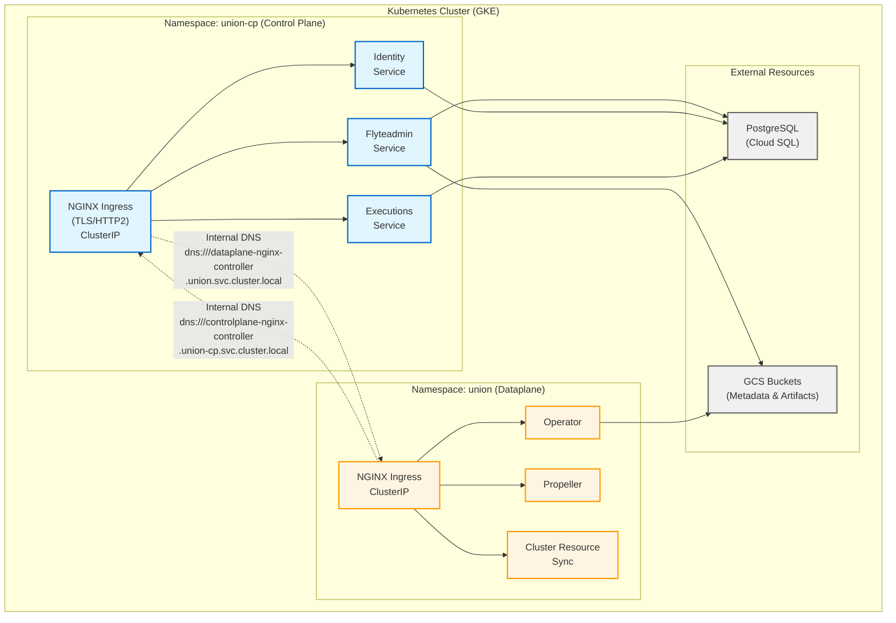

# Self-Hosted Intra-Cluster Deployment Guide (GCP)

This guide covers deploying Union control plane in the **same Kubernetes cluster** as your Union dataplane (co-located deployment). This is ideal for fully self-hosted Union deployments where both control plane and dataplane run in your infrastructure.

## Overview

In an intra-cluster deployment, the control plane and dataplane communicate using Kubernetes internal networking rather than external endpoints. This architecture simplifies networking, reduces costs, and provides complete data sovereignty.

**Important**: This guide assumes you will also deploy the dataplane in the same cluster. See the [Dataplane Intra-Cluster Guide](../dataplane/SELFHOST_INTRA_CLUSTER_GCP.md) for dataplane-specific configuration.

## Benefits of Intra-Cluster Deployment

- **Simplified networking**: All communication stays within the cluster
- **No external dependencies**: No internet connectivity required for control plane ↔ dataplane communication
- **Cost-effective**: Reduced network egress costs
- **Self-signed certificates**: Can use self-signed certs for intra-cluster TLS
- **Single-tenant mode**: Simplified security model with explicit organization configuration
- **Full data sovereignty**: All data and control remains in your infrastructure

## When to Use This Deployment Model

Choose intra-cluster deployment when:

- You want full control over both control plane and dataplane
- You're running in a single Kubernetes cluster
- You don't need Union's managed control plane services
- You want to minimize network egress costs
- You have strict data locality requirements

Choose standard hosted deployment when:

- Using Union's managed control plane (Union Cloud)
- Control plane and dataplane are in separate clusters
- You need Union's managed services and support

## Prerequisites

### Infrastructure Requirements

1. **Kubernetes cluster** (>= 1.28.0) with sufficient resources for both control plane and dataplane
   - Recommended: At least 6 nodes with 8 CPU / 16GB RAM each
   - Storage: Ability to create Persistent Volumes for Prometheus and ScyllaDB (if embedded)

2. **PostgreSQL database**:
   - Version: PostgreSQL 12+
   - Can be Cloud SQL or self-hosted in the cluster
   - Required for all control plane services

3. **ScyllaDB** (for queue service):
   - Can be deployed via the Helm chart (embedded) or externally managed
   - Required for high-performance message queueing

4. **GCS buckets**:
   - One for control plane metadata (e.g., `<prefix>-cp-flyte`)
   - One for artifacts storage (e.g., `<prefix>-cp-artifacts`)

5. **GCP service accounts** configured with Workload Identity:
   - Control plane services (with GCS access)
   - Artifacts service (with GCS access)

### Required Tools

- `kubectl` configured to access your cluster
- `helm` 3.18+
- `openssl` for TLS certificate generation

### Network Requirements

- Network connectivity between control plane and dataplane namespaces (verify network policies)
- No external ingress required (optional for external access)

## Installation Steps

### Step 1: Install Prerequisites

#### Install ScyllaDB CRDs (if using embedded ScyllaDB)

```bash
cd helm-charts/charts/controlplane
./scripts/install-scylla-crds.sh
```

#### Add Helm Repositories

```bash
helm repo add unionai https://unionai.github.io/helm-charts/
helm repo add flyte https://helm.flyte.org
helm repo update
```

### Step 2: Generate TLS Certificates

Since intra-cluster communication uses gRPC over HTTP/2, TLS is required for NGINX ingress.

#### Control Plane TLS Certificate

> You can create the objects below by using the reference Terraform module, and
> set `create_controlplane_certificate = true`.
>
>    ```
>    module "controlplane" {
>      ...
>      ...
>
>      create_controlplane_certificate = true
>    }
>    ```

```bash
# Create namespace
kubectl create namespace union-cp

# Create a self-signed certificate for the control plane
openssl req -x509 -nodes -days 365 -newkey rsa:2048 \
  -keyout controlplane-tls.key \
  -out controlplane-tls.crt \
  -subj "/CN=controlplane-nginx-controller.union-cp.svc.cluster.local" \
  -addext "subjectAltName=DNS:controlplane-nginx-controller.union-cp.svc.cluster.local"

# Create Kubernetes secret
kubectl create secret tls controlplane-tls-cert \
  --key controlplane-tls.key \
  --cert controlplane-tls.crt \
  -n union-cp
```

#### ScyllaDB Operator Webhook Certificate (if using embedded ScyllaDB)

The ScyllaDB operator requires a TLS certificate for its validating webhook. Since we are not using cert-manager, you must create this certificate manually:

```bash
# Create namespace with Helm labels (required for Helm to manage it)
kubectl create namespace scylla-operator
kubectl label namespace scylla-operator app.kubernetes.io/managed-by=Helm
kubectl annotate namespace scylla-operator \
  meta.helm.sh/release-name=unionai-controlplane \
  meta.helm.sh/release-namespace=union-cp

# Generate certificate for scylla-operator webhook
openssl req -x509 -nodes -days 365 -newkey rsa:2048 \
  -keyout /tmp/scylla-webhook.key \
  -out /tmp/scylla-webhook.crt \
  -subj "/CN=scylla-operator-webhook.scylla-operator.svc" \
  -addext "subjectAltName=DNS:scylla-operator-webhook.scylla-operator.svc,DNS:scylla-operator-webhook.scylla-operator.svc.cluster.local"

# Create secret
kubectl create secret tls scylla-operator-webhook-cert \
  --key /tmp/scylla-webhook.key \
  --cert /tmp/scylla-webhook.crt \
  -n scylla-operator
```

### Step 3: Configure Values File

Download and configure the intra-cluster values file:

```bash
# Download the self-contained intra-cluster configuration file
curl -O https://raw.githubusercontent.com/unionai/helm-charts/main/charts/controlplane/values.gcp.selfhosted-intracluster.yaml
```

Edit `values.gcp.selfhosted-intracluster.yaml` and configure the following sections:

#### Global Configuration

```yaml
global:
  # Your organization name
  UNION_ORG: "your-org"

  # Control plane host (format: <org>-cp for intra-cluster)
  UNION_HOST: "your-org-cp"

  # Database configuration (must match your Cloud SQL instance)
  DB_HOST: "<CLOUD_SQL_PRIVATE_IP>"
  DB_NAME: "unionai"
  DB_USER: "unionai"

  # GCS bucket names (must match buckets created by Terraform)
  BUCKET_NAME: "<prefix>-cp-flyte"
  ARTIFACTS_BUCKET_NAME: "<prefix>-cp-artifacts"

  # Kubernetes secret name for database password
  KUBERNETES_SECRET_NAME: "union-controlplane-secrets"

  # GCP project ID
  GOOGLE_PROJECT_ID: "<your-gcp-project-id>"

  # Image repository (contact Union for access)
  IMAGE_REPOSITORY_PREFIX: "registry.unionai.cloud/controlplane"

  # TLS configuration
  TLS_SECRET_NAMESPACE: "union-cp"
  TLS_SECRET_NAME: "controlplane-tls-cert"

  # GCP service account for Workload Identity
  FLYTEADMIN_IAM_ROLE_ARN: "flyteadmin@<project-id>.iam.gserviceaccount.com"
```

#### Image Configuration

Set the image tag for all services:

```yaml
image:
  tag: "<image-tag>"  # Contact Union for the current stable tag
```

#### Image Pull Secrets

Configure image pull secrets if using a private registry:

```yaml
imagePullSecrets:
  - name: union-registry-secret
```

Create the image pull secret:

```bash
kubectl create secret docker-registry union-registry-secret \
  --docker-server=registry.unionai.cloud \
  --docker-username='<username>' \
  --docker-password='<password>' \
  -n union-cp
```

#### Flyte Subchart Configuration

The flyte-core subchart does not render Helm templates in image references, so you must specify explicit values:

```yaml
flyte:
  # Database secret name (must be hardcoded, not a template)
  common:
    databaseSecret:
      name: "union-controlplane-secrets"

  # Image configuration for each flyte component
  flyteadmin:
    image:
      repository: registry.unionai.cloud/controlplane/services
      tag: "<image-tag>"
    serviceAccount:
      imagePullSecrets:
        - name: union-registry-secret
      annotations:
        iam.gke.io/gcp-service-account: "flyteadmin@<project-id>.iam.gserviceaccount.com"

  flytescheduler:
    image:
      repository: registry.unionai.cloud/controlplane/flytescheduler
      tag: "<image-tag>"
    serviceAccount:
      imagePullSecrets:
        - name: union-registry-secret

  datacatalog:
    image:
      repository: registry.unionai.cloud/controlplane/datacatalog
      tag: "<image-tag>"
    serviceAccount:
      imagePullSecrets:
        - name: union-registry-secret
      annotations:
        iam.gke.io/gcp-service-account: "flyteadmin@<project-id>.iam.gserviceaccount.com"

  flyteconsole:
    image:
      repository: registry.unionai.cloud/controlplane/flyteconsole
      tag: "<image-tag>"
    serviceAccount:
      imagePullSecrets:
        - name: union-registry-secret

  cacheservice:
    image:
      repository: registry.unionai.cloud/controlplane/services
      tag: "<image-tag>"
    serviceAccount:
      imagePullSecrets:
        - name: union-registry-secret
      annotations:
        iam.gke.io/gcp-service-account: "flyteadmin@<project-id>.iam.gserviceaccount.com"
```

#### Disable Unused Subcharts

For GCP deployments using Cloud SQL and GCS:

```yaml
minio:
  enabled: false

postgresql:
  enabled: false
```

#### ScyllaDB Operator Configuration

Configure the ScyllaDB operator to use your manually created certificate:

```yaml
scylla-operator:
  enabled: true
  webhook:
    createSelfSignedCertificate: false
    certificateSecretName: scylla-operator-webhook-cert
```

### Step 4: Create Database Password Secret

The control plane services require a Kubernetes secret containing the database password.

**Recommended: Use Terraform to create the secret**

The preferred approach is to use the Union reference Terraform module to create this secret automatically. The module generates a random password for Cloud SQL and creates the corresponding Kubernetes secret with the correct password.

Our reference Terraform module (`infra/terraform/modules/selfmanaged/gcp/controlplane`) includes:

- `provider.tf` - Configures the Kubernetes provider to connect to GKE
- `k8s_secrets.tf` - Creates the `union-controlplane-secrets` Kubernetes secret with the database password

Example from the Terraform module:

```hcl
# k8s_secrets.tf
resource "kubernetes_secret" "db_password" {
  count = var.gke != null ? 1 : 0

  metadata {
    name      = "union-controlplane-secrets"
    namespace = var.k8s_namespace
  }

  data = {
    "pass.txt" = random_password.db_password.result
  }

  depends_on = [kubernetes_namespace.controlplane]
}
```

**Alternative: Manual secret creation**

If you are not using the reference Terraform module, create the secret manually:

```bash
# Create secret with database password
kubectl create secret generic union-controlplane-secrets \
  --from-literal=pass.txt='YOUR_DB_PASSWORD' \
  -n union-cp
```

**Important**: Ensure the password matches the password configured for your
Cloud SQL database user.

### Step 5: Install Control Plane

Install the control plane using the configured values file:

```bash
helm upgrade --install unionai-controlplane unionai/controlplane \
  --namespace union-cp \
  --create-namespace \
  --values values.gcp.selfhosted-intracluster.yaml \
  --timeout 15m
```

**Note**: Do not use `--wait` on the first installation. The ScyllaDB operator
webhook may need to be patched before all resources can be created.

#### Patch ScyllaDB Webhook (if needed)

If the installation fails with a webhook certificate error, patch the
ValidatingWebhookConfiguration with the CA bundle:

```bash
CA_BUNDLE=$(cat /tmp/scylla-webhook.crt | base64 | tr -d '\n')
kubectl patch validatingwebhookconfiguration scylla-operator \
  --type='json' \
  -p="[{'op': 'add', 'path': '/webhooks/0/clientConfig/caBundle', 'value': '${CA_BUNDLE}'}]"
```

Then re-run the helm upgrade command.

### Step 6: Verify Control Plane Installation

```bash
# Check pod status
kubectl get pods -n union-cp

# Expected: All pods should be in Running state
# Note: ScyllaDB pods (scylla-dc1-rack1-*) may take several minutes to become ready

# Verify services are running
kubectl get svc -n union-cp

# Check flyteadmin is accessible
kubectl logs -n union-cp deploy/flyteadmin --tail=50

# Test internal connectivity
kubectl exec -n union-cp deploy/flyteadmin -- \
  curl -k https://controlplane-nginx-controller.union-cp.svc.cluster.local
```

### Step 7: Deploy Dataplane

After the control plane is running, deploy the dataplane following the
[Dataplane Intra-Cluster Guide](../dataplane/SELFHOST_INTRA_CLUSTER_GCP.md).

The dataplane will connect to the control plane using the service endpoints
configured in Step 3.

## Key Configuration Details

### Single-Tenant Mode

Intra-cluster deployments uses an experimental single-tenant mode with an
explicit organization. Refer to
[values.gcp.selfhosted-intracluster.yaml](./values.gcp.selfhosted-intracluster.yaml)
for example configuration.

```yaml
global:
  # Update here to your organization designation
  UNION_ORG: ""

  # There are references to .Values.global.UNION_ORG where the
  # override is configured.
```

### TLS Requirements

gRPC requires TLS for HTTP/2 with NGINX. Refer to
[values.gcp.selfhosted-intracluster.yaml](./values.gcp.selfhosted-intracluster.yaml)
for example configuration.

```yaml
global:
  # Configure namespace and name of the Kubernetes TLS secret.
  TLS_SECRET_NAMESPACE: ""
  TLS_SECRET_NAME: ""

ingress-nginx:
  controller:
    extraArgs:
      # NOTE: This has to be explicitly set.
      default-ssl-certificate: "<TLS_SECRET_NAMESPACE>/<TLS_SECRET_NAME>"
```

### Service Discovery

Control plane services discover each other via Kubernetes DNS:

- **Flyteadmin**: `flyteadmin.union-cp.svc.cluster.local:81`
- **NGINX Ingress**: `controlplane-nginx-controller.union-cp.svc.cluster.local`
- **Dataplane** (for dataproxy): `dataplane-nginx-controller.union.svc.cluster.local`

## Architecture Diagram



**Key Points:**

- **Blue (Control Plane)**: Services in `union-cp` namespace
- **Orange (Dataplane)**: Services in `union` namespace
- **Gray (External)**: GCP-managed resources (Cloud SQL, GCS)
- **Dotted Lines**: Intra-cluster communication via Kubernetes DNS
- **Solid Lines**: Service dependencies within namespaces

## Troubleshooting

### Control plane pods not starting

```bash
# Check pod events
kubectl describe pod -n union-cp <pod-name>

# Check for resource constraints
kubectl top nodes

# Verify secrets exist
kubectl get secret -n union-cp
```

### Image pull errors

If pods show `ImagePullBackOff` or `ErrImagePull`:

1. Verify image pull secret exists:
   ```bash
   kubectl get secret union-registry-secret -n union-cp
   ```

2. Check the secret is correctly configured:
   ```bash
   kubectl get secret union-registry-secret -n union-cp -o jsonpath='{.data.\.dockerconfigjson}' | base64 -d
   ```

3. Ensure the `imagePullSecrets` is configured in the values file and for flyte subcharts.

4. Verify image repositories are set correctly (not pointing to AWS ECR for GCP deployments).

### TLS/Certificate errors

```bash
# Verify TLS secret exists
kubectl get secret controlplane-tls-cert -n union-cp

# Check certificate details
kubectl get secret controlplane-tls-cert -n union-cp -o jsonpath='{.data.tls\.crt}' | base64 -d | openssl x509 -text -noout

# Check NGINX ingress logs
kubectl logs -n union-cp deploy/controlplane-nginx-controller
```

### ScyllaDB webhook errors

If you see errors like `failed calling webhook "webhook.scylla.scylladb.com"`:

1. Ensure the scylla-operator namespace exists with Helm labels:
   ```bash
   kubectl get ns scylla-operator -o yaml
   ```

2. Verify the webhook certificate secret exists:
   ```bash
   kubectl get secret scylla-operator-webhook-cert -n scylla-operator
   ```

3. Patch the webhook with the CA bundle (see Step 5).

4. If the webhook configuration doesn't exist yet, delete any stale webhook and retry:
   ```bash
   kubectl delete validatingwebhookconfiguration scylla-operator
   ```

### Database connection failures

- Verify database credentials in the secret:

  ```bash
  kubectl get secret union-controlplane-secrets -n union-cp -o jsonpath='{.data.pass\.txt}' | base64 -d
  ```

- Ensure the password is not a placeholder value like `YOUR_DB_PASSWORD`.

- Check network connectivity to PostgreSQL:

  ```bash
  kubectl run -n union-cp test-db --image=postgres:14 --rm -it -- \
    psql -h <DB_HOST> -U <DB_USER> -d <DB_NAME>
  ```

### GCS bucket access errors

If pods fail with `storage.buckets.create` or similar permission errors:

1. Verify the bucket names in your values file match the actual GCS buckets:
   ```bash
   gsutil ls | grep <prefix>
   ```

2. Check that Workload Identity is configured correctly:
   ```bash
   kubectl get sa flyteadmin -n union-cp -o yaml | grep iam.gke.io/gcp-service-account
   ```

3. Verify the GCP service account has the required IAM permissions on the buckets.

### Dataplane cannot connect to control plane

- Verify control plane service endpoints:

  ```bash
  kubectl get svc -n union-cp | grep -E 'flyteadmin|nginx-controller'
  ```

- Test DNS resolution from dataplane namespace:

  ```bash
  kubectl run -n union test-dns --image=busybox --rm -it -- \
    nslookup controlplane-nginx-controller.union-cp.svc.cluster.local
  ```

- Check network policies:

  ```bash
  kubectl get networkpolicies -n union-cp
  kubectl get networkpolicies -n union
  ```

### Workload Identity issues

- Verify service account annotations:

  ```bash
  kubectl get sa -n union-cp -o yaml | grep iam.gke.io/gcp-service-account
  ```

- Check IAM bindings:

  ```bash
  gcloud iam service-accounts get-iam-policy <SERVICE_ACCOUNT_EMAIL>
  ```

- Verify pod can authenticate:

  ```bash
  kubectl exec -n union-cp deploy/flyteadmin -- \
    curl -H "Metadata-Flavor: Google" \
    http://metadata.google.internal/computeMetadata/v1/instance/service-accounts/default/email
  ```

## Reference Configuration Files

- [values.gcp.yaml](values.gcp.yaml) - Standard GCP configuration (for hosted control plane deployments)
- [values.gcp.selfhosted-intracluster.yaml](values.gcp.selfhosted-intracluster.yaml) - Self-contained intra-cluster configuration

## Next Steps

1. **Deploy Dataplane**: Follow the [Dataplane Intra-Cluster Guide](../dataplane/SELFHOST_INTRA_CLUSTER_GCP.md)
2. **Configure Users**: Set up user authentication and RBAC
3. **Test Workflows**: Run a test workflow to verify the complete stack
4. **Set Up Monitoring**: Configure Prometheus and Grafana for observability

## Additional Resources

- [Main Installation Guide](README.md) - Standard control plane deployment
- [Dataplane Installation Guide](../dataplane/README.md) - Dataplane setup
- [Dataplane Intra-Cluster Guide](../dataplane/SELFHOST_INTRA_CLUSTER_GCP.md) - Dataplane intra-cluster setup
- [Union Documentation](https://docs.union.ai) - Full documentation
- [ScyllaDB Operator Documentation](https://operator.docs.scylladb.com/)
- [GKE Workload Identity Documentation](https://cloud.google.com/kubernetes-engine/docs/how-to/workload-identity)
