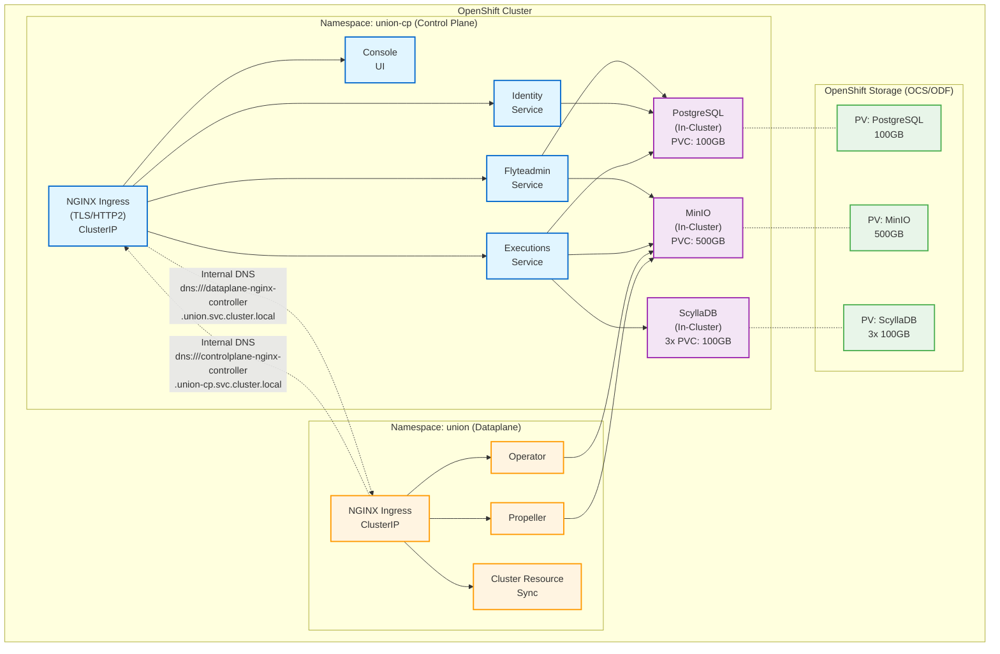

# Self-Hosted Intra-Cluster Deployment Guide (OpenShift)

This guide covers deploying Union control plane in the **same OpenShift cluster** as your Union dataplane (co-located deployment). This deployment includes in-cluster PostgreSQL and MinIO, providing a fully self-contained installation without external cloud dependencies.

## Overview

In an intra-cluster OpenShift deployment, the control plane and dataplane communicate using Kubernetes internal networking. This configuration supports PostgreSQL for database storage and S3-compatible object storage (MinIO, S3, etc.), which can be existing installations or deployed via the chart.

**Important**: This guide assumes you will also deploy the dataplane in the same cluster. See the Dataplane documentation for dataplane-specific configuration.

## Benefits of OpenShift Intra-Cluster Deployment

- **Flexible database options**: Use existing PostgreSQL or deploy new instance via chart
- **Flexible storage options**: Use existing MinIO or deploy new instance via chart
- **Simplified networking**: All communication stays within the cluster
- **OpenShift native**: Uses OpenShift Routes, Security Context Constraints, and storage classes
- **Cost-effective**: No external RDS or S3 costs when using in-cluster components
- **Self-signed certificates**: Can use self-signed certs for intra-cluster TLS
- **Single-tenant mode**: Simplified security model with explicit organization configuration
- **Complete data sovereignty**: All data and control remains in your OpenShift cluster
- **Air-gapped compatible**: Can run in disconnected environments

## When to Use This Deployment Model

Choose OpenShift intra-cluster deployment when:

- You're running on OpenShift (OCP, OKD, or OpenShift Dedicated)
- You want a fully self-contained installation without cloud dependencies
- You're running in a single OpenShift cluster
- You have strict data locality or air-gap requirements
- You want to minimize external cloud costs

Choose AWS/cloud deployment when:

- Using managed services like RDS and S3
- Control plane and dataplane are in separate clusters
- You need Union's managed control plane services

## Prerequisites

### Infrastructure Requirements

1. **OpenShift cluster** (>= 4.12) with sufficient resources for both control plane and dataplane
   - Recommended: At least 6 worker nodes with 8 CPU / 16GB RAM each
   - Storage: Dynamic storage provisioner (OCS/ODF, Portworx, or similar)
   - Total persistent volume capacity: ~1TB recommended

2. **Storage Classes**:
   - Block storage for PostgreSQL (RWO)
   - Block storage for MinIO (RWO)
   - Block storage for ScyllaDB (RWO)
   - Example: `ocs-storagecluster-ceph-rbd` (OpenShift Container Storage/Data Foundation)

3. **Cluster Resources** (minimum):
   - PostgreSQL: 2 CPU / 4GB RAM, 100GB storage
   - MinIO: 2 CPU / 4GB RAM, 500GB storage
   - ScyllaDB: 2 CPU / 4GB RAM, 100GB storage (x3 replicas)
   - Control plane services: 8 CPU / 16GB RAM total
   - Dataplane services: 4 CPU / 8GB RAM total

4. **Network Requirements**:
   - Network connectivity between control plane and dataplane namespaces
   - Verify network policies allow cross-namespace communication

### Required Tools

- `oc` (OpenShift CLI) configured to access your cluster
- `helm` 3.18+
- `openssl` or `cert-manager` for TLS certificate generation

### Required Permissions

- Cluster admin access for:
  - Creating namespaces
  - Installing operators (ScyllaDB Operator)
  - Creating Security Context Constraints (if needed)

## Installation Steps

### Step 1: Install Prerequisites

#### Install ScyllaDB CRDs (if using embedded ScyllaDB)

```bash
cd helm-charts/charts/controlplane
./scripts/install-scylla-crds.sh
```

#### Add Helm Repositories

```bash
helm repo add unionai https://unionai.github.io/helm-charts/
helm repo add flyte https://helm.flyte.org
helm repo add bitnami https://charts.bitnami.com/bitnami
helm repo update
```

### Step 2: Create Namespace

```bash
oc create namespace union-cp
```

### Step 3: Generate TLS Certificates

Since intra-cluster communication uses gRPC over HTTP/2, TLS is required for NGINX ingress.

**Option A: Using OpenSSL (self-signed)**

```bash
# Create a self-signed certificate
openssl req -x509 -nodes -days 365 -newkey rsa:2048 \
  -keyout controlplane-tls.key \
  -out controlplane-tls.crt \
  -subj "/CN=controlplane-nginx-controller.union-cp.svc.cluster.local"

# Create Kubernetes secret
oc create secret tls controlplane-tls-cert \
  --key controlplane-tls.key \
  --cert controlplane-tls.crt \
  -n union-cp
```

**Option B: Using cert-manager (recommended for production)**

See the example in `values.openshift.selfhosted-intracluster.yaml` under the `extraObjects` section.

### Step 4: Configure Values File

Download and configure the OpenShift intra-cluster values file:

```bash
# Download the self-contained OpenShift configuration file
curl -O https://raw.githubusercontent.com/unionai/helm-charts/main/charts/controlplane/values.openshift.selfhosted-intracluster.yaml
```

Edit `values.openshift.selfhosted-intracluster.yaml` and configure the following **required** variables:

**IMPORTANT**: The values file is configured by default to use **existing PostgreSQL and S3-compatible storage** installations. If you want the chart to deploy these components for you, set:
- `postgresql.enabled: true`
- `minio.enabled: true`

#### Required Configuration for Existing PostgreSQL/Storage

If using existing PostgreSQL and S3-compatible storage (default: `postgresql.enabled: false`, `minio.enabled: false`):

```yaml
global:
  # PostgreSQL configuration (existing installation)
  DB_HOST: "postgresql.databases.svc.cluster.local"  # CHANGE to your PostgreSQL endpoint
  DB_PORT: 5432
  DB_NAME: "unionai"
  DB_USER: "unionai"

  # S3-compatible storage configuration (existing installation)
  STORAGE_ENDPOINT: "minio.storage.svc.cluster.local:9000"  # CHANGE to your storage endpoint
  STORAGE_ACCESS_KEY: "minio-admin"  # CHANGE to your storage access key
  STORAGE_SECRET_KEY: "minio-password"  # CHANGE to your storage secret key
  BUCKET_NAME: "union-controlplane-metadata"
  ARTIFACTS_BUCKET_NAME: "union-controlplane-artifacts"

  # Organization name (must match dataplane)
  UNION_ORG: "my-organization"  # CHANGE THIS

  # Internal Flyteadmin service endpoint
  FLYTEADMIN_ENDPOINT: "flyteadmin.union-cp.svc.cluster.local:81"

  # Control plane ingress controller FQDN
  CONTROLPLANE_INTRA_CLUSTER_HOST: "controlplane-nginx-controller.union-cp.svc.cluster.local"

  # TLS secret configuration
  TLS_SECRET_NAMESPACE: "union-cp"
  TLS_SECRET_NAME: "controlplane-tls-cert"

  # Dataplane ingress controller URL
  DATAPLANE_ENDPOINT: "http://dataplane-nginx-controller.union.svc.cluster.local:80"
```

**Note**: Ensure these databases exist in your PostgreSQL instance:
- `unionai` (main database)
- `flyteadmin`
- `datacatalog`
- `cacheservice`

And ensure these buckets exist in your S3-compatible storage:
- Bucket specified in `BUCKET_NAME`
- Bucket specified in `ARTIFACTS_BUCKET_NAME`

#### Update TLS Secret in NGINX Configuration

Edit the file and replace the placeholder in the NGINX section:

```yaml
ingress-nginx:
  controller:
    extraArgs:
      # Replace with your actual values
      default-ssl-certificate: 'union-cp/controlplane-tls-cert'
```

#### Optional: Deploy PostgreSQL/MinIO via Chart

If you want the chart to deploy PostgreSQL and MinIO for you, enable them and configure:

```yaml
# Enable in-cluster PostgreSQL deployment
postgresql:
  enabled: true  # Set to true to deploy PostgreSQL
  global:
    postgresql:
      auth:
        username: unionai
        password: "CHANGE_ME_IN_PRODUCTION"  # Set a strong password
        database: unionai

# Enable in-cluster MinIO deployment
minio:
  enabled: true  # Set to true to deploy MinIO
  auth:
    rootUser: "minio-root-user"
    rootPassword: "CHANGE_ME_IN_PRODUCTION"  # Set a strong password

# Then leave DB_HOST and STORAGE_ENDPOINT empty in global section
global:
  DB_HOST: ""  # Auto-configured when postgresql.enabled=true
  STORAGE_ENDPOINT: ""  # Auto-configured when minio.enabled=true
  STORAGE_CLASS: "ocs-storagecluster-ceph-rbd"  # Required for PVCs
```

**Best Practice**: Use OpenShift secrets or External Secrets Operator instead of plaintext passwords.

### Step 5: Prepare Existing PostgreSQL and S3-Compatible Storage (if using existing installations)

If you're using existing PostgreSQL and S3-compatible storage installations, you need to prepare them:

#### PostgreSQL Preparation

Create the required databases:

```bash
# Connect to your PostgreSQL instance
psql -h postgresql.databases.svc.cluster.local -U postgres

# Create user and databases
CREATE USER unionai WITH PASSWORD 'your-password';
CREATE DATABASE unionai OWNER unionai;
CREATE DATABASE flyteadmin OWNER unionai;
CREATE DATABASE datacatalog OWNER unionai;
CREATE DATABASE cacheservice OWNER unionai;

# Grant privileges
GRANT ALL PRIVILEGES ON DATABASE unionai TO unionai;
GRANT ALL PRIVILEGES ON DATABASE flyteadmin TO unionai;
GRANT ALL PRIVILEGES ON DATABASE datacatalog TO unionai;
GRANT ALL PRIVILEGES ON DATABASE cacheservice TO unionai;
```

#### S3-Compatible Storage Preparation

Create the required buckets using MinIO client (for MinIO) or AWS CLI (for S3):

**For MinIO:**
```bash
# Using MinIO client (mc)
mc alias set mycloud http://minio.storage.svc.cluster.local:9000 minio-admin minio-password

# Create buckets
mc mb mycloud/union-controlplane-metadata
mc mb mycloud/union-controlplane-artifacts

# Verify buckets were created
mc ls mycloud/
```

**For AWS S3:**
```bash
aws s3 mb s3://union-controlplane-metadata
aws s3 mb s3://union-controlplane-artifacts
```

Or use the storage provider's web console to create the buckets.

### Step 6: Create Database Password Secret

Create a secret containing the PostgreSQL password for Union services:

```bash
# Create secret with database password (must match postgresql.global.postgresql.auth.password)
oc create secret generic union-controlplane-secrets \
  --from-literal=pass.txt='YOUR_DB_PASSWORD' \
  -n union-cp
```

### Step 7: Install Control Plane

Install the control plane using the self-contained OpenShift values file:

```bash
helm upgrade --install unionai-controlplane unionai/controlplane \
  --namespace union-cp \
  --values values.openshift.selfhosted-intracluster.yaml \
  --timeout 20m \
  --wait
```

**What gets installed:**

1. **PostgreSQL** (optional, if `postgresql.enabled: true`):
   - Single instance with persistent volume
   - Databases: `unionai`, `flyteadmin`, `datacatalog`, `cacheservice`
   - Service: `unionai-controlplane-postgresql.union-cp.svc.cluster.local:5432`

2. **MinIO** (optional, if `minio.enabled: true`):
   - Standalone mode with persistent volume
   - Buckets: configured via `BUCKET_NAME` and `ARTIFACTS_BUCKET_NAME`
   - Service: `unionai-controlplane-minio.union-cp.svc.cluster.local:9000`

3. **ScyllaDB** (via Scylla Operator):
   - 3-node cluster for queue service
   - Persistent volumes for each node
   - Service: `scylla-client.union-cp.svc.cluster.local`

4. **NGINX Ingress Controller**:
   - ClusterIP service for intra-cluster routing
   - TLS enabled for gRPC/HTTP2

5. **Union Control Plane Services**:
   - Flyteadmin, Identity, Executions, Artifacts, Console, etc.

### Step 8: Verify Control Plane Installation

```bash
# Check pod status
oc get pods -n union-cp

# Verify all components are running
oc get pods -n union-cp | grep -E 'postgresql|minio|scylla|flyteadmin'

# Check persistent volume claims
oc get pvc -n union-cp

# Verify services are accessible
oc get svc -n union-cp

# Check flyteadmin is accessible
oc logs -n union-cp deploy/flyteadmin --tail=50

# Test internal connectivity
oc exec -n union-cp deploy/flyteadmin -- \
  curl -k https://controlplane-nginx-controller.union-cp.svc.cluster.local
```

**Expected output:**

- All pods should be in `Running` state
- PVCs should be `Bound`
- Services should have ClusterIP addresses
- Internal connectivity test should succeed

### Step 9: Verify Database Connectivity

#### If using existing PostgreSQL

Test connectivity from control plane to your PostgreSQL:

```bash
# Test connection from flyteadmin pod
oc exec -n union-cp deploy/flyteadmin -- \
  psql -h postgresql.databases.svc.cluster.local -U unionai -d unionai -c 'SELECT version();'
```

#### If using chart-deployed PostgreSQL

Check that PostgreSQL databases were created:

```bash
# Connect to PostgreSQL pod
POD=$(oc get pod -n union-cp -l app.kubernetes.io/name=postgresql -o jsonpath='{.items[0].metadata.name}')

# List databases
oc exec -n union-cp $POD -- psql -U unionai -c '\l'
```

You should see: `unionai`, `flyteadmin`, `datacatalog`, `cacheservice` databases.

### Step 10: Verify S3-Compatible Storage Connectivity

#### If using existing S3-compatible storage

Test connectivity from control plane to your storage:

```bash
# Test storage API endpoint (MinIO example)
oc exec -n union-cp deploy/flyteadmin -- \
  curl -v http://minio.storage.svc.cluster.local:9000/minio/health/live
```

Verify buckets exist:

**For MinIO:**
```bash
mc alias set mycloud http://minio.storage.svc.cluster.local:9000 minio-admin YOUR_PASSWORD
mc ls mycloud/
```

**For AWS S3:**
```bash
aws s3 ls
```

#### If using chart-deployed MinIO

Check that MinIO buckets were created:

```bash
# Port-forward to MinIO console (optional, for web UI access)
oc port-forward -n union-cp svc/unionai-controlplane-minio 9001:9001

# Open browser to http://localhost:9001
# Login with credentials from values file
```

Or use the MinIO client:

```bash
# Configure MinIO client
mc alias set local http://localhost:9000 minio-root-user YOUR_PASSWORD
mc ls local/
```

You should see the buckets configured in `BUCKET_NAME` and `ARTIFACTS_BUCKET_NAME`.

### Step 11: Deploy Dataplane

After the control plane is running, deploy the dataplane following the Dataplane installation guide.

The dataplane will connect to the control plane using the service endpoints configured in Step 4.

## Key Configuration Details

### PostgreSQL Database

The deployment supports two modes:

**Option 1: Use Existing PostgreSQL** (default: `postgresql.enabled: false`)
- Point to your existing PostgreSQL service via `global.DB_HOST`
- Manually create required databases: `unionai`, `flyteadmin`, `datacatalog`, `cacheservice`
- Provide credentials via `global.DB_USER` and secret

**Option 2: Deploy PostgreSQL via Chart** (`postgresql.enabled: true`)
- Uses Bitnami PostgreSQL chart
- **Single instance** (not HA by default)
- **Persistent volume**: 100GB (configurable)
- **Automatic database creation**: via `initdb` scripts
- **OpenShift-compatible security contexts**

For production HA with Option 2:
- Enable read replicas: `postgresql.readReplicas.replicaCount: 2`
- Use PostgreSQL Operator for advanced features
- Or use external managed PostgreSQL

### S3-Compatible Object Storage

The deployment supports two modes:

**Option 1: Use Existing S3-Compatible Storage** (default: `minio.enabled: false`)
- Point to your existing storage service via `global.STORAGE_ENDPOINT`
- Supports MinIO, AWS S3, or any S3-compatible storage
- Manually create required buckets (specified in `BUCKET_NAME` and `ARTIFACTS_BUCKET_NAME`)
- Provide credentials via `global.STORAGE_ACCESS_KEY` and `global.STORAGE_SECRET_KEY`

**Option 2: Deploy MinIO via Chart** (`minio.enabled: true`)
- Uses Bitnami MinIO chart
- **Standalone mode** (single instance)
- **Persistent volume**: 500GB (configurable)
- **S3-compatible API**: works with all S3 SDKs
- **Auto-bucket creation**: via `defaultBuckets`

For production HA with Option 2:
- **Distributed mode**: `minio.mode: distributed` with 4+ nodes
- **Erasure coding**: for data redundancy
- Or use external object storage (e.g., AWS S3, Azure Blob)

### Single-Tenant Mode

OpenShift intra-cluster deployments use single-tenant mode with an explicit organization:

```yaml
global:
  UNION_ORG: "my-organization"  # Must match dataplane

configMap:
  sharedService:
    security:
      singleTenantOrgID: '{{ .Values.global.UNION_ORG }}'
```

### TLS Requirements

gRPC requires TLS for HTTP/2 with NGINX:

```yaml
global:
  TLS_SECRET_NAMESPACE: "union-cp"
  TLS_SECRET_NAME: "controlplane-tls-cert"

ingress-nginx:
  controller:
    extraArgs:
      default-ssl-certificate: "union-cp/controlplane-tls-cert"
```

### Service Discovery

Control plane services discover each other via Kubernetes DNS:

- **PostgreSQL**: `unionai-controlplane-postgresql.union-cp.svc.cluster.local:5432` (if chart-deployed)
- **S3-compatible storage**: `unionai-controlplane-minio.union-cp.svc.cluster.local:9000` (if chart-deployed)
- **Flyteadmin**: `flyteadmin.union-cp.svc.cluster.local:81`
- **NGINX Ingress**: `controlplane-nginx-controller.union-cp.svc.cluster.local`
- **Dataplane**: `dataplane-nginx-controller.union.svc.cluster.local`

### OpenShift Routes (Optional)

To expose services externally using OpenShift Routes, uncomment the routes section in `values.openshift.selfhosted-intracluster.yaml`:

```yaml
global:
  ENABLE_ROUTES: true

# In extraObjects section:
- apiVersion: "route.openshift.io/v1"
  kind: "Route"
  metadata:
    name: "controlplane-console"
  spec:
    host: "union-console.apps.your-cluster.example.com"
    to:
      kind: "Service"
      name: "console"
    tls:
      termination: "edge"
```

## Architecture Diagram



**Key Points:**

- **Blue (Control Plane)**: Services in `union-cp` namespace
- **Orange (Dataplane)**: Services in `union` namespace
- **Purple (Infrastructure)**: In-cluster databases and storage
- **Green (Storage)**: OpenShift persistent volumes
- **Dotted Lines**: Intra-cluster communication via Kubernetes DNS
- **Solid Lines**: Service dependencies

## Troubleshooting

### Control plane pods not starting

```bash
# Check pod events
oc describe pod -n union-cp <pod-name>

# Check for resource constraints
oc adm top nodes

# Verify secrets exist
oc get secret -n union-cp

# Check security context constraints
oc get scc
oc describe pod -n union-cp <pod-name> | grep -i scc
```

### PostgreSQL connection failures

```bash
# Check PostgreSQL pod status
oc get pod -n union-cp -l app.kubernetes.io/name=postgresql

# Check PostgreSQL logs
oc logs -n union-cp -l app.kubernetes.io/name=postgresql

# Verify database password secret
oc get secret union-controlplane-secrets -n union-cp -o jsonpath='{.data.pass\.txt}' | base64 -d

# Test connection from another pod
oc run -n union-cp test-db --image=postgres:14 --rm -it -- \
  psql -h unionai-controlplane-postgresql.union-cp.svc.cluster.local -U unionai -d unionai

# Check if databases were created
POD=$(oc get pod -n union-cp -l app.kubernetes.io/name=postgresql -o jsonpath='{.items[0].metadata.name}')
oc exec -n union-cp $POD -- psql -U unionai -c '\l'
```

### S3-compatible storage connection failures

**For chart-deployed MinIO:**
```bash
# Check MinIO pod status
oc get pod -n union-cp -l app.kubernetes.io/name=minio

# Check MinIO logs
oc logs -n union-cp -l app.kubernetes.io/name=minio

# Test MinIO API endpoint
oc exec -n union-cp deploy/flyteadmin -- \
  curl -v http://unionai-controlplane-minio.union-cp.svc.cluster.local:9000

# Verify buckets exist (requires mc client)
oc port-forward -n union-cp svc/unionai-controlplane-minio 9000:9000
# Then use mc client: mc ls local/
```

**For existing storage:**
```bash
# Test storage endpoint
oc exec -n union-cp deploy/flyteadmin -- \
  curl -v http://YOUR_STORAGE_ENDPOINT

# Verify credentials are correct
# Check STORAGE_ACCESS_KEY and STORAGE_SECRET_KEY in values file
```

### Persistent Volume issues

```bash
# Check PVC status
oc get pvc -n union-cp

# Check PV status
oc get pv | grep union-cp

# Check storage class
oc get sc

# Describe PVC for events
oc describe pvc -n union-cp <pvc-name>

# Check if storage provisioner is working
oc get pods -n openshift-storage  # For OCS/ODF
```

### TLS/Certificate errors

```bash
# Verify TLS secret exists
oc get secret controlplane-tls-cert -n union-cp

# Check certificate details
oc get secret controlplane-tls-cert -n union-cp -o jsonpath='{.data.tls\.crt}' | base64 -d | openssl x509 -text -noout

# Check NGINX ingress logs
oc logs -n union-cp deploy/controlplane-nginx-controller

# Verify NGINX is using the correct certificate
oc exec -n union-cp deploy/controlplane-nginx-controller -- cat /etc/nginx/nginx.conf | grep ssl_certificate
```

### Dataplane cannot connect to control plane

```bash
# Verify control plane service endpoints
oc get svc -n union-cp | grep -E 'flyteadmin|nginx-controller'

# Test DNS resolution from dataplane namespace
oc run -n union test-dns --image=busybox --rm -it -- \
  nslookup controlplane-nginx-controller.union-cp.svc.cluster.local

# Test connectivity from dataplane to control plane
oc run -n union test-cp --image=curlimages/curl --rm -it -- \
  curl -k https://controlplane-nginx-controller.union-cp.svc.cluster.local

# Check network policies
oc get networkpolicies -n union-cp
oc get networkpolicies -n union
```

### ScyllaDB issues

```bash
# Check ScyllaDB pods
oc get pod -n union-cp -l app.kubernetes.io/name=scylla

# Check ScyllaDB operator
oc get pod -n union-cp -l app.kubernetes.io/name=scylla-operator

# Check ScyllaDB cluster status
oc get scyllaclusters -n union-cp

# Check ScyllaDB logs
oc logs -n union-cp -l app.kubernetes.io/name=scylla
```

## Production Hardening

### Database High Availability

Enable PostgreSQL read replicas:

```yaml
postgresql:
  readReplicas:
    replicaCount: 2
    persistence:
      size: 100Gi
    resources:
      limits:
        cpu: 2000m
        memory: 4Gi
```

### MinIO High Availability

Switch to distributed mode (requires 4+ nodes):

```yaml
minio:
  mode: distributed
  statefulset:
    replicaCount: 4
  persistence:
    size: 500Gi
```

### Backup and Recovery

Set up regular backups:

```bash
# PostgreSQL backups
oc exec -n union-cp <postgres-pod> -- \
  pg_dump -U unionai unionai > backup-$(date +%Y%m%d).sql

# MinIO backups (using mc mirror)
mc mirror local/union-controlplane-metadata backup/metadata
mc mirror local/union-controlplane-artifacts backup/artifacts
```

### Resource Limits

Set appropriate resource limits for production:

```yaml
postgresql:
  primary:
    resources:
      limits:
        cpu: 4000m
        memory: 8Gi
      requests:
        cpu: 2000m
        memory: 4Gi

minio:
  resources:
    limits:
      cpu: 4000m
      memory: 8Gi
    requests:
      cpu: 2000m
      memory: 4Gi
```

### Monitoring

Enable metrics exporters:

```yaml
postgresql:
  metrics:
    enabled: true
    serviceMonitor:
      enabled: true

minio:
  metrics:
    serviceMonitor:
      enabled: true
```

## Reference Configuration Files

- [values.openshift.selfhosted-intracluster.yaml](values.openshift.selfhosted-intracluster.yaml) - Self-contained OpenShift intra-cluster configuration
- [values.aws.selfhosted-intracluster.yaml](values.aws.selfhosted-intracluster.yaml) - AWS intra-cluster configuration (for comparison)

## Next Steps

1. **Deploy Dataplane**: Follow the Dataplane installation guide
2. **Configure Users**: Set up user authentication and RBAC
3. **Test Workflows**: Run a test workflow to verify the complete stack
4. **Set Up Monitoring**: Configure Prometheus and Grafana for observability
5. **Implement Backups**: Set up regular backup procedures
6. **Harden Security**: Review and apply OpenShift security best practices

## Additional Resources

- [Main Installation Guide](README.md) - Standard control plane deployment
- [Dataplane Installation Guide](../dataplane/README.md) - Dataplane setup
- [OpenShift Documentation](https://docs.openshift.com) - OpenShift platform documentation
- [Union Documentation](https://docs.union.ai) - Full Union documentation
- [ScyllaDB Operator Documentation](https://operator.docs.scylladb.com/)
- [Bitnami PostgreSQL Chart](https://github.com/bitnami/charts/tree/main/bitnami/postgresql)
- [Bitnami MinIO Chart](https://github.com/bitnami/charts/tree/main/bitnami/minio)
